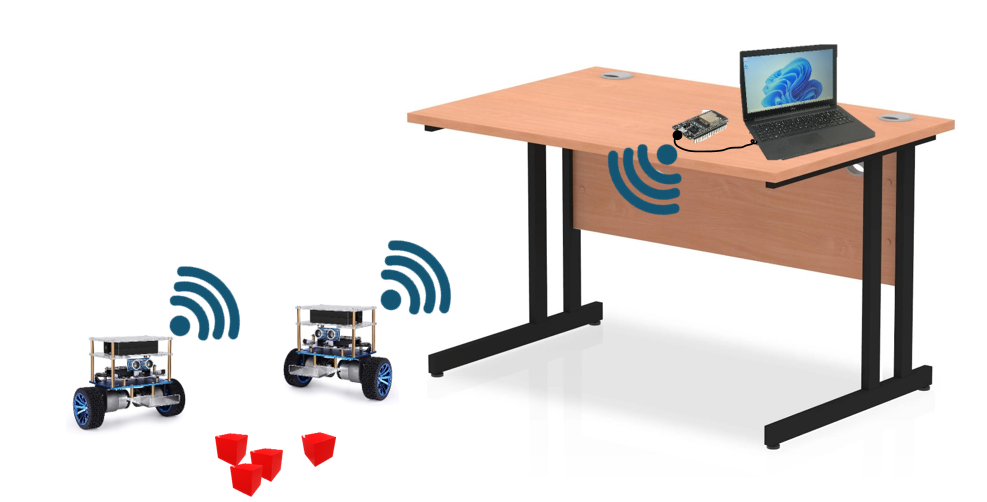

<div align="center">
  
# 🤖 Project S.P.L.I.T.
**Snapping Pendulums Literally In Two**

[](https://opensource.org/licenses/MIT)
[](https://isocpp.org/)
[](https://www.python.org/)
[](https://platformio.org/)

*A highly advanced, self-balancing robotic swarm architecture utilizing distributed Dual-MCU processing, cascaded PID control, and computer vision for high-density indoor micro-logistics.*


**[🎥 Watch the Project Trailer on YouTube](https://youtu.be/ys7Rda4Vqj8?si=qLUs55d14E2go74t)**

</div>

---

## 📖 Table of Contents
1. [About the Project](#-about-the-project)
2. [Swarm Demonstration](#-swarm-demonstration)
3. [Distributed Hardware Architecture](#-distributed-hardware-architecture-dual-mcu)
4. [Control Theory & Physics](#-control-theory--physics)
5. [Real-Time Telemetry Dashboard](#-real-time-telemetry-dashboard)
6. [Computer Vision & Teleoperation](#-computer-vision--teleoperation)
7. [Repository Structure](#-repository-structure)

---

## 🚀 About the Project

Modern warehouse facilities face a critical spatial bottleneck: traditional four-wheeled logistics robots require massive floor space and wide aisles to maneuver safely. 

**Project S.P.L.I.T.** is a self-balancing robotic swarm developed at the **University of Prince Mugrin (UPM)**. By navigating exclusively on two wheels as inverted pendulums, these robots drastically reduce their physical footprint. This allows industrial facilities to narrow their aisles and maximize high-density storage without sacrificing payload capacity.



---

## 🤖 Swarm Demonstration

*Click the image below to watch the physical robots balancing and maneuvering together:*

[](https://youtu.be/6psPYHQWWL8?si=IynwXiYcK6a_89gq)

---

## 🧠 Distributed Hardware Architecture (Dual-MCU)

One of the most fatal flaws in DIY robotics is asking a single microcontroller to handle both high-speed physics calculations and heavy wireless network routing. Pausing for just a few milliseconds to process a Wi-Fi packet causes a balancing robot to violently crash.

We solved this by establishing a **Distributed Dual-MCU Architecture** governed by a central Bridge router:


1. **The Drive MCU (Physics Engine):** An ESP32 dedicated entirely to survival. Its Wi-Fi radio is physically disabled. It reads the MPU6050 IMU, tracks the quadrature encoders, and executes the 200 Hz balancing math.
2. **The Cortex MCU (The Brain):** A secondary ESP32 that handles payload actuation (Servo Gripper) and acts as the communications relay. It communicates with the Drive MCU via a 500,000 baud hardware UART connection, utilizing a custom `0xAA 0xAA` header packet to prevent data corruption.
3. **The Bridge MCU (The Router):** A central hub plugged into the control station. It hosts a local Wi-Fi Access Point and Web Server, routing traffic to the robot swarm via the ultra-low-latency ESP-NOW protocol.

---

## ⚖️ Control Theory & Physics

Keeping a two-wheeled robot upright requires absolute mathematical precision. To maintain equilibrium, we implemented a **Cascaded PID (Proportional-Integral-Derivative) Controller**.

The system relies on three simultaneous control loops working in harmony:
* **Inner Angle Loop (200 Hz):** Calculates the difference between the robot's current tilt and the target angle, outputting raw PWM signals to the motor drivers to prevent falling.
* **Outer Speed/Position Loop (10 Hz):** Reads high-resolution wheel encoders. If the robot drifts, it calculates a position error and shifts the *Target Angle* of the inner loop, causing the robot to lean and drive to the correct location.
* **Yaw Loop (200 Hz):** Reads the Z-axis gyroscope to ensure motors spin in perfect synchronization.

> **Note on Sensor Fusion:** We bypassed the MPU6050's built-in DMP to avoid processing delays. Instead, we pull raw accelerometer and gyroscope data via a 400kHz I2C bus and run it through our own **Kalman Filter** to neutralize motor vibrations and correct gyroscope drift.

---

## 📊 Real-Time Telemetry Dashboard

Tuning a cascaded PID controller requires extreme patience. To solve this, we built a comprehensive telemetry dashboard hosted entirely on the Bridge MCU's SPIFFS memory.


*Click the image below to watch the live Telemetry Dashboard and auto-scaling graphs in action:*

[](https://youtu.be/Q8Spe14jKmc?si=H875WhGmwUKity3f)

---

## 👁️ Computer Vision & Teleoperation

Because onboard cameras would shift the center of mass, we offloaded vision processing to an external global system running on a laptop (The "Eye in the Sky").

* **ArUco Pathfinding:** A Python script utilizing OpenCV detects distinct ArUco markers on each robot. It calculates the robot's exact X/Y coordinates and Yaw (heading direction), generating forward throttle and steering vectors to route the robot to its destination.
* **Hand Gesture Control:** Integrated **MediaPipe Hand Tracking** maps 21 3D landmarks of a human hand. The system translates physical hand gestures into direct kinematic commands, allowing operators to direct the swarm seamlessly.

*Click the image below to watch the autonomous Computer Vision pathfinding in action:*

[](https://youtu.be/ys7Rda4Vqj8?si=IiXEYzNkCtTVPJel)

---

## 📁 Repository Structure

```text
SPLIT-Robotics-Swarm/
├── Firmware/                                  # Embedded C++ code for the ESP32s
│   ├── bridge-controller/                     # Standard Arduino bridge code
│   ├── bridge-controller-spiffs-web-dashboard/# PlatformIO bridge environment
│   │   ├── data/                              # SPIFFS Web Files (HTML/CSS/JS)
│   │   ├── src/                               # Main bridge source code (don't use this one)
│   │   └── platformio.ini                     # PlatformIO configuration
│   ├── cortex-controller/                     # Robot 1: ESP-NOW relay & Servo
│   ├── cortex-controller-B/                   # Robot 2: ESP-NOW relay & Servo
│   ├── drive-controller/                      # Robot 1: 200Hz PID & Kalman math
│   └── drive-controller-B/                    # Robot 2: 200Hz PID & Kalman math
│
├── Software/                                  # Off-board applications
│   └── Computer Vision/           
│       ├── hand_gesture.py                    # MediaPipe hand gesture script
│       ├── robot_aruco_guard.py               # ArUco tracking and vector math
│       └── requirements.txt                   # Python dependencies
│
├── Hardware/                                  # Physical design references
│   ├── circuit diagram concept.jpeg           # System wiring diagram
│   └── (pinout reference images)              # ESP32, L298N, and Motor pinouts
│
├── Testing/                                   # Isolated step-by-step calibration scripts
│   ├── Testing-encoders/             
│   ├── Testing-IMU-calibration/               # Script to find MPU6050 offsets
│   ├── Testing-motors/
│   ├── Testing-MAC-address/
│   ├── self-balancing-1-loop/                 # Incremental PID testing
│   ├── self-balancing-2-loops/
│   ├── self-balancing-3-loops/
│   └── (other component tests)
│
└── Docs/                                      # Images, posters, and documentation